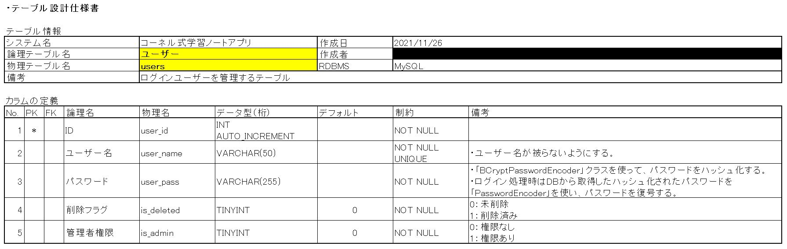

# コーネル式学習ノートアプリ
- 「[コーネル式勉強ノート](https://studyhacker.net/study-notebook-how-to-summarize#%E3%82%B3%E3%83%BC%E3%83%8D%E3%83%AB%E5%BC%8F "コーネル式勉強ノート")」をブラウザ上で実現するWebアプリ。

# 使用技術
- Java 8
- Spring boot 2.6.1
- Spring Security
- Mybatis 2.2.0
- MySQL 8.0.30
- HTML / CSS
- JavaScript
- Thymeleaf
- Bootstrap 4.6.0
- JQuery 3.5.1

# 機能一覧
- ログイン / ログアウト機能
- ユーザー登録 / 更新 /削除機能
- 学習した事を「コーネル式勉強ノート」の形で、アウトプットする機能
- アウトプットの更新 / 削除機能
- アウトプットの一覧表示 / 詳細表示機能
- アウトプットの検索機能

# DB設計

